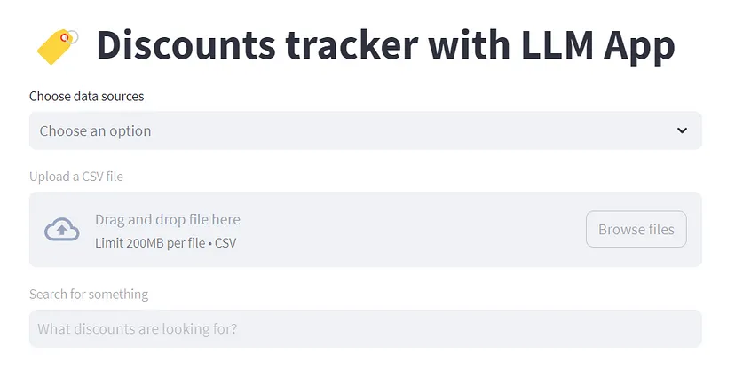

# 6.4. Amazon Discounts App

In this tutorial, we will build an app called "Amazon Discounts App" that can find real-time sales and deals for Amazon products by leveraging the LLM App library.



In this case, instead of cloning this Discounts app repository, we'll try to observe and learn how it uses LLM App with the Rainforest Prices API to give the desired results.
In this app, we have two data sources:

This app relies on two primary data sources:

1. [Rainforest API for Amazon Prices](https://www.rainforestapi.com/)
2. Discounts CSV containing product and price data

These two sources are used just to show how you can upload a CSV along with another data source. While you can use a similar approach with other APIs, even this showcase opens up considerable possibilities in E-Commerce applications

## 6.4.1. How the Project Works

The project accomplishes its tasks through a series of steps shared below. Make sure you give it a quick read before proceeding to the next step where we explore the repository.

### 1. Real-time Indexing

**Sourcing Data:** A script simulates real-time data from external sources, creating or updating a file named `discounts.csv` with random data. Additionally, a scheduled task (cron job) runs every minute to fetch the latest data from the Rainforest API. Crontab, a time-based job scheduler, facilitates this process.

**Choosing Data Source(s):** The provided Streamlit UI allows the selection of either Rainforest API or CSV as a data source. It maps each row into a jsonline schema for effective management of large datasets, representing each row as a separate JSON object.

**Chunking:** Documents are divided into shorter sections to be converted into vector embeddings.

**Embedding of Data Source:** The shorter sections undergo processing through the OpenAI API to generate embeddings.

**Real-time Vector Indexing:** An index is created based on these embeddings, enabling swift searches in subsequent steps.

### 2. Query (Prompt) Embedding and Retrieval

**Query Embedding:** For any user question, an embedding is generated using the OpenAI API for embeddings, specifically, `text-embedding-ada-002`.

**Retrieving:** The system compares the vector embedding of the query/prompt with the vector embedding of the data source to identify the most relevant information.

### 3. Prompt Augmentation and Answer Generation

**Packaging into a Message:** The query/prompt and the most relevant sections of data are combined into a message, staying within the token limit.

**Get Answer from GPT:** This message is sent to `gpt-3.5-turbo`, which provides an answer.

## 6.4.2. Repository Walkthrough

In this specific example, we'll delve deeper to demonstrate how this application was created, providing insights for you to build your own.

### Link to the Project

The repository in question can be found [here on GitHub](https://github.com/Boburmirzo/chatgpt-api-python-sales). If you have experience with open source, visiting the above link should empower you to seamlessly build a similar project.

### Step by Step Process to Build the Application

To comprehend the code, read the Streamlit blog featured below. It highlights the open-source application developed by Bobur.

[How to build a real-time LLM App | Official Streamlit Blog](https://blog.streamlit.io/build-a-real-time-llm-app-without-vector-databases-using-pathway/)

### Video Tutorial

After reading the blog, check out the video tutorial by Bobur Umurzakov, Developer Advocate at Pathway, for a quick walkthrough of the code and the open-source repository.

[YouTube Video](https://youtu.be/IxdeW_Ndi_8)

### Key Things to Note

- This app is modular; you can add new data sources or interfaces.
- It is scalable to include more advanced features like additional data formats or APIs.
- Streamlit and Pathway's LLM App communicate over HTTP REST API, but they can also be integrated in other ways, such as file sharing or inter-process communication.

By following this guide, you'll create a versatile application capable of real-time interactions with users, providing valuable insights into Amazon discounts.

## 6.5. How to Run Examples

Congratulations for reaching this point! 🎉

If you wish to go beyond the Amazon Discounts App and Dropbox Retrieval App, this module makes it easy for you to build and run your applications using Examples on the [LLM App](https://github.com/pathwaycom/llm-app).

### What are Examples?

Popular open-source frameworks often include an "examples" folder in their GitHub repositories. While not mandatory, this folder serves the purpose of providing practical, real-world demonstrations of how the software or code within the repository can be used. The [LLM App GitHub repo](https://github.com/pathwaycom/llm-app) also features such examples, covering:

- Demonstrations of the software's features.
- Educational examples for new users.
- Various use case scenarios.
- Code snippets and templates for easy use.
- Examples for testing new updates.
- Community-contributed examples for diverse applications.

### Examples Offered for LLM App

The LLM App official repository offers multiple possible use-cases under its [examples](https://github.com/pathwaycom/llm-app/tree/main/examples/pipelines) folder to illustrate various scenarios. Once you've cloned the LLM App repository and set up the environment variables (as per the steps mentioned on [this link](https://github.com/pathwaycom/llm-app#step-1-clone-the-repository)), you're all set to run the examples.

Here's a table detailing the types of examples you can explore:

| Example Type      | What It Does                                                   | What's Special                      | Good For                                     |
|-------------------|----------------------------------------------------------------|-------------------------------------|----------------------------------------------|
| contextless       | Answers your questions without looking at any additional data. | Simplest example to try. Not RAG based. | Beginners to get started.                   |
| contextful        | Uses extra documents in a folder to help answer questions.     | Better answers by using more data.   | More advanced, detailed answers.             |
| contextful_s3     | Like "Contextful," but stores documents in S3.                 | Good for handling a lot of data.     | Businesses or advanced projects.            |
| unstructured      | Reads different types of files like PDFs, Word docs, etc.      | Can handle many file formats.        | Working with various file types.            |
| local             | Runs everything on your own machine without sending data out.  | Keeps your data private.             | Those concerned about data privacy.         |
| unstructuredtosql | Takes data from different files and puts it in a SQL database.  | Great for complex queries.           | Advanced data manipulation and queries.     |


# Simple Way to Run Examples on LLM App

Assuming you've completed the necessary steps beforehand, here's a straightforward, step-by-step process to easily run the examples:

1. Open a terminal and navigate to the LLM App repository folder:

   ```bash
   cd llm-app
   ```

2. Choose Your Example. The examples are located in the [`examples`](https://github.com/pathwaycom/llm-app/tree/main/examples/pipelines) folder. Let's say you want to run the 'alert' example. You have two options:

   - Option 1: Run the centralized example runner. This allows you to quickly switch between different examples:

     ```bash
     python run_examples.py alert
     ```

   - Option 2: Navigate to the specific pipeline folder and run the example directly. This option is more focused and best if you know exactly which example you're interested in:

     ```bash
     python examples/pipelines/contextful/app.py
     ```

That's it! 😄

By following these steps, you're not just running code; you're actively engaging with the LLM App’s rich feature set, which can include anything from real-time data syncing to model monitoring.

It's a step closer to implementing your LLM application that can have a meaningful impact. 💪

[Previous Lesson](https://github.com/gtech-mulearn/Pathway-AI-Bootcamp/blob/main/HANDS%20ON%20IMPLEMENTATION%20MODULE%20Part-2.md)🔙📚

