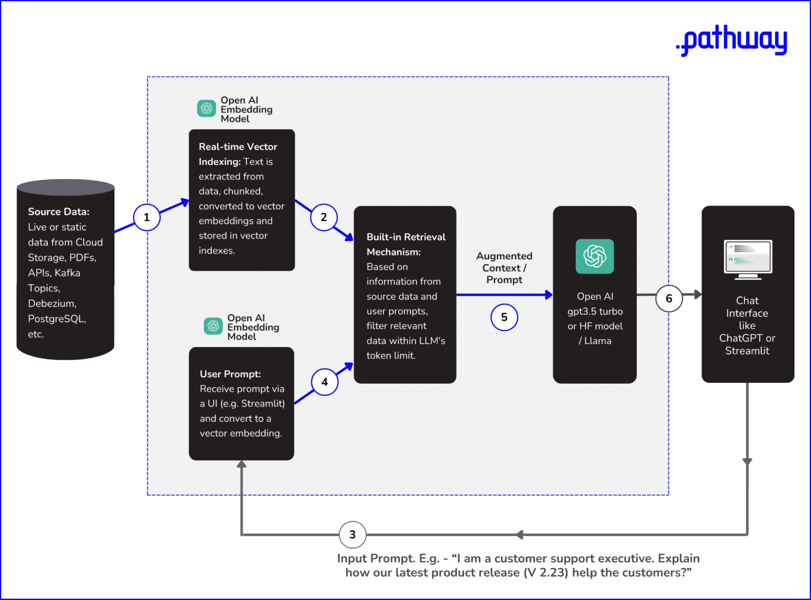

# RAG MODULE

## 5.10. In-Context Learning

In this video, you'll be introduced to the concept of in-context learning through prompts. Anup explains how this form of learning is scalable, particularly when dealing with vast amounts of data.

This becomes especially relevant when we recall our earlier discussions on Retrieval Augmented Generation (RAG). Understanding in-context learning amplifies the efficacy of technologies like RAG in Large Language Models.

[Watch Video](https://youtu.be/OXZQBXBvOR4?t=284)

## 5.11. High-level LLM Architecture Components for In-context Learning

In this brief video, Anup provides a high-level breakdown of how in-context learning operates within an LLM. He'll guide you through the journey of a prompt as it interacts with a vector database or index, undergoes similarity search, feeds context, and eventually results in a coherent LLM output. Understanding this architecture is essential for mastering the interaction between prompts and LLMs, a crucial skill for anyone looking to effectively deploy these models in a variety of settings.

[Watch Video](https://youtu.be/OXZQBXBvOR4?t=595)

As you may have noticed, the concepts explained under 'in-context learning' in the forthcoming sections are essentially what RAG accomplishes. In-context learning allows your LLM to adapt and respond based on not just the pre-trained data, but also from the external, real-time information it retrieves. This is precisely what RAG is designed to do.

## 5.12. Diving Deeper: LLM Architecture Components

In the forthcoming video, we provide a detailed explanation of the essential components that constitute a Large Language Model's architecture. This video aims to extend your comprehension of the LLM architecture, contributing to your foundational understanding of the field.

In this video, we've learned about

- The User Interface Component designed to pose questions
- The Storage Layer, which utilizes Vector DB or Vector Indexes
- The Service, Chain, or Pipeline Layer, which is instrumental in the model's functioning (with a brief mention of the Chain Library used for chaining prompts)
- Summary of our learnings around LLM Architecture Components

Let's look at a cleaner architecture diagram, and various steps of the pipeline and summarize the advantages of RAG based on what we've understood so far.

[Watch Video](https://youtu.be/OXZQBXBvOR4?t=704)

## 5.13. LLM Architecture Diagram and Various Steps

Now that we've explored the various components that make up the architecture of Large Language Models (LLMs), let's dive into how Retrieval-Augmented Generation (RAG) can work synergistically with these components of an LLM architecture. The aim is to show you how RAG can supercharge an LLM's capabilities by seamlessly integrating real-time or static data sources into the information retrieval and generation processes.

### LLM Architecture

**LLM Architecture Diagram to show how RAG works with Real-time or Static Data Sources**

For a nuanced understanding of how Retrieval-Augmented Generation (RAG) optimizes Large Language Models, we'll delve into the essential elements and procedural steps that comprise the LLM architecture.

- **Data Sources:** Whether your starting point is cloud storage, Git repositories, or databases like PostgreSQL, the first task is to bring these varied data forms together through pre-configured connectors.
- **Dynamic Vector Indexing:** Text from these data sources is broken down into smaller segments (also called "chunks") and converted into vector representations. Models specialized for text embeddings, such as OpenAI's text-embedding-ada-002, are employed here. These vectors are continuously indexed to facilitate rapid search later on.
- **Query Transformation:** A user’s input query is likewise transformed into a compatible vector representation, ensuring that it can be effectively matched with the indexed vectors for data retrieval.
- **Contextual Retrieval:** Algorithms like Locality-Sensitive Hashing (LSH) are applied to find the closest matches between the user query and the indexed data vectors, staying within the model's token limitations.
- **Text Generation:** With the retrieved context, foundational LLMs like GPT-3.5 Turbo or Llama-2 employ techniques from the Transformer architecture, such as self-attention, to generate an appropriate response.
- **User Interface:** Finally, the generated text is presented to the user via interfaces like Streamlit or ChatGPT.

## 5.14. RAG versus Fine-Tuning and Prompt Engineering

In the rapidly evolving landscape of Large Language Models (LLMs), achieving cost-efficiency and operational simplicity is critical, and this is where Retrieval-Augmented Generation (RAG) shines. When compared to methods like Fine-tuning and Prompt engineering, RAG stands out due to its advantages in cost-effectiveness, simplicity, and adaptability.

Let's individually explore these options to understand where RAG excels.

### 1. Fine Tuning Vs RAG

For those less familiar with the concept, fine-tuning involves modifying a pre-trained language model (such as GPT-3.5 Turbo, Mistral-7b, or Llama-2) with a smaller, targeted dataset to work optimally for specific use cases.

While fine-tuning avoids the need to build a model from scratch, it does have its drawbacks, which RAG effectively addresses.

- **Data Preparation Challenges:** Having control over training data permits steps to address biases, yet implementing such measures is far from straightforward. Interventions like altering variable importance or ensuring balanced data distribution demand in-depth data analysis skills.
- **Cost Efficiency:** Retraining and deployment are not only time-consuming but also financially taxing. For instance, the use of vector embeddings API in RAG models is roughly 80 times less expensive compared to commonly utilized fine-tuning APIs from OpenAI. Consider the need to repeat this process each time your company launches a new product, all to ensure that your teams are not provided with outdated information from your Gen AI model.
- **Data Freshness:** At the outset, it's only logical to expect that when developing an LLM application, you'd want your large language model to consistently deliver current and pertinent out. When it comes to fine-tuning, the model's accuracy can significantly decline if the data undergoes changes or isn't regularly updated. Consequently, despite the associated challenges, this task must be performed at frequent intervals to maintain the model's efficacy.

Hence in practical scenarios, for performance-related reasons, if certain developers or companies use fine-tuned models instead of general foundational models such as GPT-4, they often use those models with an RAG-based architecture itself.

### 2. Prompt Engineering vs RAG

Prompt engineering might seem like a lighter alternative but comes with its own set of challenges, such as data privacy, inefficient retrieval of information, and the technical constraint of a token limit.

- **Data Privacy:** For organizations handling sensitive information, the act of manually copy-pasting large chunks of data to retrieve a specific piece poses a risk of unintended data exposure.
- **Inefficient Retrieval:** When dealing with vast data corpora, knowing where to find the relevant data becomes crucial. Manual prompt engineering lacks the efficiency offered by automated

 mechanisms, such as vector indexing in RAG, which enables quick and semantically accurate data retrieval.
- **Token Limit Constraints:** Language models have built-in token limitations, restricting the amount of text they can process in a single prompt. This makes it challenging to include all the necessary information in one interaction.

In contrast, RAG's approach of storing data in efficient vector indexes circumvents these limitations by facilitating quick and semantically relevant information retrieval, making it a more viable option for dealing with large and complex data sets.

[Next Lesson](../Level-6/HANDS-ON-IMPLEMENTATION-MODULE-Part-1.md)📖👣🔜

[Previous Lesson](../Level-5/LLM-Architecture-and-RAG-Part-5.md)🔙📚
